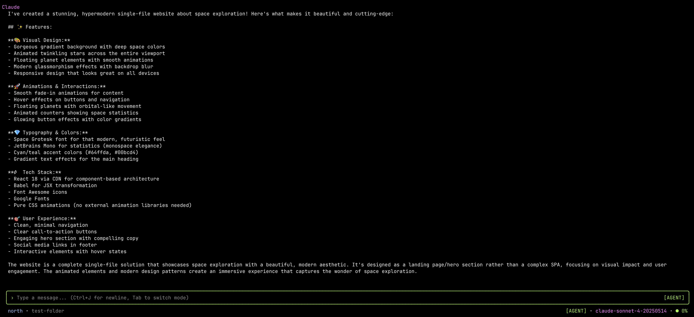

# North

**The terminal-native AI coding assistant that actually ships.**

An AI pair programmer that lives in your terminal. Supports Claude (Anthropic) and GPT-5 (OpenAI). No IDE lock-in, no subscription tiers, no bloat—just you, the model of your choice, and your codebase.




## Why North?

<!-- Showcasing North's precise editing capabilities! Demo edit made on 2024-12-20 -->
**99.3% edit success rate.** North's deterministic edit tools with exact-match verification mean edits land correctly the first time. No fuzzy matching, no silent failures.

**One-shots production-ready code.** Complex React components, full API endpoints, beautiful landing pages—North builds them in a single pass. The kind of output that takes other tools 10+ iterations.

**Direct API access.** You bring your own API key (Anthropic or OpenAI). No middleman pricing, no usage caps, no "you've hit your daily limit." Pay only for what you use at provider rates.

**200K context that manages itself.** Real-time context tracking with visual indicators (🟢 green < 60%, 🟡 yellow 60-85%, 🔴 red > 85%). Auto-summarization kicks in at 92% context usage, compressing conversation history into structured summaries while preserving recent messages. No manual context pruning, no "start a new chat" interruptions.

**Terminal-native speed.** No Electron overhead, no browser tabs, no VS Code plugin lifecycle. North launches instantly and runs lean.

## Features

### Two Modes, Zero Friction

- **Ask Mode** (`Tab` to toggle): Read-only exploration. Claude can search, read files, and analyze—but can't modify anything. Perfect for understanding unfamiliar codebases.
- **Agent Mode**: Full access to edit and shell tools. Claude proposes, you approve.

The status line shows your current mode with a color-coded badge: **[ASK]** in blue, **[AGENT]** in green. Context usage appears on the right with a real-time percentage meter.

### Intelligent Approvals

Every file edit shows an inline diff before writing. Every shell command requires explicit permission. You stay in control.

```
┌─ Editing src/components/Button.tsx ────────────────┐
│  - export const Button = ({ label }) => (          │
│  + export const Button = ({ label, icon }) => (    │
│      <button className={styles.button}>            │
│  +     {icon && <Icon name={icon} />}              │
│        {label}                                     │
│      </button>                                     │
│    );                                              │
├────────────────────────────────────────────────────┤
│  [a] Accept  [y] Always  [r] Reject                │
└────────────────────────────────────────────────────┘
```

Press `y` once to auto-accept all future edits in a session. Or build a shell command allowlist so trusted operations (`bun test`, `npm run build`) run without prompts.

### Model Switching

Switch between models on the fly—even across providers:

```
/model opus-4.5       # Switch to Claude Opus 4.5
/model sonnet-4       # Switch to Claude Sonnet 4 (default)
/model gpt-5.1-codex  # Switch to GPT-5.1 Codex
/model gpt-5-mini     # Switch to GPT-5 Mini for speed
```

**Anthropic models:** Sonnet 4, Opus 4, Opus 4.1, Sonnet 4.5, Haiku 4.5, Opus 4.5

**OpenAI models:** GPT-5.1, GPT-5.1 Codex, GPT-5.1 Codex Mini, GPT-5.1 Codex Max, GPT-5, GPT-5 Mini, GPT-5 Nano

### Cursor Rules Compatible

Drop your `.cursor/rules/*.mdc` files in and North automatically loads them. Same project context, different interface.

### Project Learning

On first run in a new project, North offers to learn your codebase. It runs 10 discovery passes covering architecture, conventions, domain vocabulary, data flow, dependencies, build workflows, hotspots, common tasks, and safety rails. The resulting profile is stored at `~/.north/projects/<hash>/profile.md` and automatically injected into every conversation.

Use `/learn` anytime to re-learn the project after major changes.

### Slash Commands

| Command | Usage | Description |
|---------|-------|-------------|
| `/model [name]` | `/model opus-4.5` or `/model` | Switch model (shows picker if no argument). Supports all Anthropic and OpenAI models. Selection persists across sessions. |
| `/mode [ask\|agent]` | `/mode ask` or `/mode` | Switch conversation mode (shows picker if no argument). Also toggleable via `Tab` key. |
| `/learn` | `/learn` | Learn or relearn the project codebase. Overwrites existing profile. |
| `/summarize [--keep-last N]` | `/summarize --keep-last 10` | Compress conversation history into structured summary, keeping last N messages verbatim (default: 10). |
| `/new` | `/new` | Start fresh conversation (clears transcript and summary, preserves shell session). |
| `/help` | `/help` | List all available commands with descriptions. |
| `/quit` | `/quit` | Exit North cleanly. |

Commands can be mixed with regular messages: `/model sonnet-4 Can you help me refactor this?`

## Install

### Binary (Recommended)

Download the latest release from [GitHub Releases](https://github.com/timanthonyalexander/north/releases):

| Platform | Binary |
|----------|--------|
| macOS (Apple Silicon) | `north-darwin-arm64` |
| macOS (Intel) | `north-darwin-x64` |
| Linux (x64) | `north-linux-x64` |

```bash
chmod +x north-darwin-arm64
mv north-darwin-arm64 /usr/local/bin/north
```

Set your API key(s):

```bash
export ANTHROPIC_API_KEY="sk-ant-..."  # For Claude models
export OPENAI_API_KEY="sk-..."         # For GPT models
```

Run:

```bash
north
```

Point at any repo:

```bash
north --path /path/to/repo
```

### Manual Build (Optional)

Requires [Bun](https://bun.sh):

```bash
git clone https://github.com/timanthonyalexander/north.git
cd north
bun install
bun run dev
```

Build standalone binaries:

```bash
bun run build:binary              # current platform
bun run build:binary:mac-arm      # Apple Silicon
bun run build:binary:mac-x64      # Intel Mac
bun run build:binary:linux        # Linux x64
```

## Input & Keyboard Shortcuts

### Composer

- `Enter` — Send message
- `Shift+Enter` or `Ctrl+J` — Add newline
- `Tab` — Cycle modes (ask → agent) or accept autocomplete suggestion
- `Up/Down` — Navigate autocomplete suggestions
- `Esc` — Close autocomplete
- `Ctrl+C` — Cancel operation (when processing) or exit (when idle)

### Review Prompts

**Diff Review (file edits):**
- `a` — Accept this edit only
- `y` — Always (enable auto-accept for all future edits)
- `r` — Reject this edit

**Shell Review (commands):**
- `r` — Run this command once
- `a` — Always (add to allowlist, no future prompts for this command)
- `y` — Auto all (auto-approve all future shell commands in this project)
- `d` — Deny this command

**Command Review (e.g., model selection):**
- `Up/Down` — Navigate options
- `Enter` — Select
- `Esc` — Cancel

**Learning Prompt (first run):**
- `y` — Accept (learn project)
- `n` — Decline (skip learning)

## Tools

### Read & Navigation (auto-approved)

| Tool | Purpose |
|------|---------|
| `list_root` | List repository root entries |
| `find_files` | Search files by glob pattern (e.g., `*.tsx`, `**/*.test.ts`) |
| `search_text` | Text/regex search with ripgrep acceleration. Supports file+lineRange scoping |
| `read_file` | Read file content with line ranges and smart context modes (imports/full) |
| `get_line_count` | Quick file size check before reading large files |
| `get_file_symbols` | Extract symbols (functions, classes, types) without reading full file |
| `get_file_outline` | Hierarchical structure outline with line ranges |
| `read_readme` | Auto-detect and read README files |
| `detect_languages` | Analyze language composition by extension and size |
| `hotfiles` | Find frequently modified files via git history |

### Large File Navigation Strategy

North includes specialized tools for efficiently navigating large files without reading entire contents:

1. **Check size first** with `get_line_count` to determine if special handling is needed
2. **Understand structure** using `get_file_symbols` (functions, classes) or `get_file_outline` (hierarchical view)
3. **Find targets** with `search_text` scoped to specific files and line ranges
4. **Read strategically** using `read_file` with targeted line ranges and optional context modes

This approach reduces token usage by 60-80% when working with large files.

### Edit Tools (require approval)

| Tool | Purpose |
|------|---------|
| `edit_replace_exact` | Replace exact text matches (deterministic, no fuzzy matching) |
| `edit_insert_at_line` | Insert content at specific line number |
| `edit_create_file` | Create new files or overwrite existing ones |
| `edit_apply_batch` | Apply multiple edits atomically (all-or-nothing) |

### Shell Tool (requires approval)

| Tool | Purpose |
|------|---------|
| `shell_run` | Execute shell commands with 60s timeout. Build an allowlist to skip approval prompts for trusted commands |

All tools respect `.gitignore`. Output is automatically truncated to prevent context overflow.

## Storage

**Global config** (`~/.config/north/config.json`):
- `selectedModel` — persisted model selection across sessions

**Project profiles** (`~/.north/projects/<hash>/`):
- `profile.md` — learned project context (architecture, conventions, workflows)
- `declined.json` — marker if learning was declined

**Project config** (`.north/` at your repo root):
- `allowlist.json` — pre-approved shell commands
- `autoaccept.json` — auto-accept edit settings (press `y` in any diff review to enable)

**Logs:** `~/.local/state/north/north.log` (JSON-lines format)

## Troubleshooting

**Search is slow?** Install ripgrep for 10-100x faster searches: `brew install ripgrep` or `apt install ripgrep`. North falls back to pure JS implementation if ripgrep isn't available.

**Edit tool fails?** North's edit tools require exact text matches including whitespace. Claude will re-read the file and retry—usually self-corrects within 1-2 attempts.

**Shell command times out?** Commands have a 60-second timeout by default. Each command runs in a fresh bash process using Bun's built-in `Bun.spawn()` API.

**Context overflow?** Auto-summarization triggers at 92% context usage. You can also manually run `/summarize` to compress the conversation history at any time.

**Model not available?** Ensure you've set the correct API key:
- Claude models require `ANTHROPIC_API_KEY`
- GPT models require `OPENAI_API_KEY`

## Development

```bash
bun run dev                    # run North in development
bun run dev --log-level debug  # verbose logging
bun run build                  # build JS bundle
bun run typecheck              # TypeScript type checking
bun run lint                   # ESLint linting
bun run lint:fix               # ESLint with auto-fix
bun run format                 # Format code with Prettier
bun run format:check           # Check Prettier formatting
bun run check                  # all checks (typecheck + lint + format:check)
bun test                       # run test suite
bun test --watch               # run tests in watch mode
```

**Code Quality:**
- ESLint with TypeScript, React, and React Hooks plugins
- Prettier with 4-space indentation, double quotes, semicolons
- Pre-commit hooks (type check + lint + format verification)
- Enable hooks: `bun run prepare` or `git config core.hooksPath .githooks`

**Architecture:** [docs/implementation.md](docs/implementation.md)

## Comparisons

### How North Compares

| Category | North | Claude Code | Cursor | Aider | OpenAI Codex CLI | Gemini CLI | GitHub Copilot | Cline | Windsurf |
|----------|-------|--------------|--------|--------|--------------------|-------------|------------------|--------|-----------|
| Pricing | Direct API keys (you pay provider) | Claude Pro/Max subscription (and other auth options exist) | Subscription tiers; Pro includes usage and "unlimited Auto" routing | Open-source; you pay model/provider usage | Uses OpenAI; CLI is open-source | Free tier quotas + paid tiers (Google account based) | Subscription plans (Free/Pro/Pro+/Business/Enterprise); CLI included in paid | Extension is free; pay inference via your provider (or Cline provider) | Subscription credit plans (Pro/Teams/Enterprise) |
| Environment | Terminal | Terminal CLI | Desktop IDE | Terminal | Terminal | Terminal | IDE + terminal CLI tool | VS Code extension | Desktop IDE |
| Context | 200K + auto-summary | Model-dependent (Claude) | Model-dependent; plan mentions "maximum context windows" | Model-dependent; you choose provider/model | Model-dependent; agent runs locally and uses chosen model | Up to 1M token context (Gemini 2.5 Pro) | Model-dependent; plan-gated premium requests | Model-dependent; depends on chosen provider/model | "Fast Context" marketed; model-dependent |
| Control | Approve every edit/command | Permission rules are configurable and can be remembered | Agent Review exists; can manage multi-file diffs | Git-based workflow and diffs are core | Supports approval modes and review flows | Built-in tools (file ops, shell); user-driven CLI flow | Chat/agent features with plan request allowances; CLI is available | Agentic edits inside VS Code; depends on configuration | IDE agent workflow; plan-based usage |
| Transparency | Full diff review | Permission + settings model; CLI-first visibility | Review UI for diffs | Very transparent via patches/commits | Review + diff-oriented workflows | CLI output + open-source; tool actions visible | Mixed (suggestions, chat, agent features) | Visible edits in-editor; still an IDE extension | IDE-based; visibility depends on workflow |

### Feature Capabilities

**Legend:** ✓ = yes, ✗ = no, ~ = partial / limited / depends on plan or model

| Capability | **North** | **Claude Code** | **Codex CLI** | **Gemini CLI** | **Aider** | **Cline** | **Cursor** | **Windsurf** | **Copilot CLI** |
|---|---|---|---|---|---|---|---|---|---|
| **Terminal-native interactive UI** | ✓ | ✓ | ✓ | ✓ | ✓ | ✗ | ✗ | ✗ | ✓ |
| **BYOK (bring your own API key)** | ✓ | ✓ | ✓ | ~ | ✓ | ✓ | ✓ | ~ | ✗ |
| **Multi-provider switching** | ✓ | ✗ | ✗ | ✗ | ✓ | ✓ | ✓ | ~ | ✗ |
| **Explicit approvals for writes/shell** | ✓ | ✓ | ✓ | ✓ | ~ | ✓ | ~ | ~ | ~ |
| **Fine-grained allowlist controls** | ✓ | ✓ | ✓ | ~ | ~ | ✓ | ~ | ~ | ✗ |
| **Deterministic edit primitives** | ✓ | ✗ | ✗ | ✗ | ✗ | ✗ | ✗ | ✗ | ✗ |
| **Inline diff review (first-class UX)** | ✓ | ~ | ~ | ~ | ✓ | ✓ | ✓ | ✓ | ✗ |
| **Cursor rules ingestion** | ✓ | ✗ | ✗ | ✗ | ✗ | ✗ | ✓ | ✗ | ✗ |
| **No vendor subscription required** | ✓ | ~ | ~ | ✓ | ✓ | ✓ | ~ | ~ | ✗ |
| **Open-source core** | ✓ | ✗ | ✓ | ✓ | ✓ | ✓ | ✗ | ✗ | ✗ |
| **1M-token context option** | ✗ | ✗ | ✗ | ✓ | ~ | ✗ | ✗ | ✗ | ✗ |
| **MCP / external tool servers** | ✗ | ✗ | ✓ | ✓ | ~ | ✓ | ~ | ~ | ✗ |
| **GitHub PR agent workflows** | ✗ | ✗ | ✓ | ~ | ✗ | ~ | ✗ | ✗ | ✗ |

**Where North stands out:**

North is the only tool that combines **terminal-native**, **multi-provider BYOK**, and **deterministic edit primitives** with exact-match verification. The safety model doesn't require trust: every risky operation shows an inline diff with explicit approval. You're not locked to one editor, one vendor, or one AI provider.

**North's roadmap opportunities:**

- **MCP plugin ecosystem** (Codex CLI, Gemini CLI, and Cline have mature plugin support)
- **PR automation workflows** (Codex CLI leads here with tag bots and automated reviews)
- **Ultra-large context** (Gemini CLI offers 1M-token context windows with Gemini 2.5 Pro)

## Privacy

Logs record events and metadata (tool names, durations, token counts) but not file contents or prompts. Your messages go directly to the provider's API (Anthropic or OpenAI)—no intermediary servers, no data collection.

---

**North.** Vibe coding peak.
